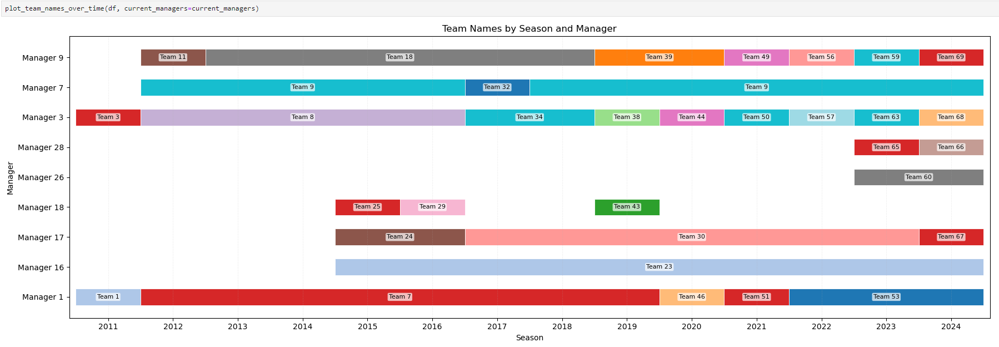
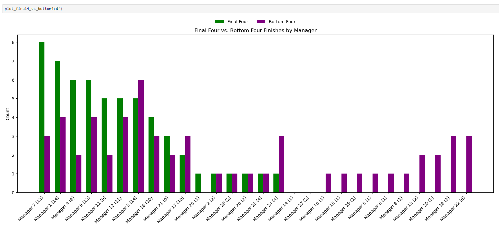
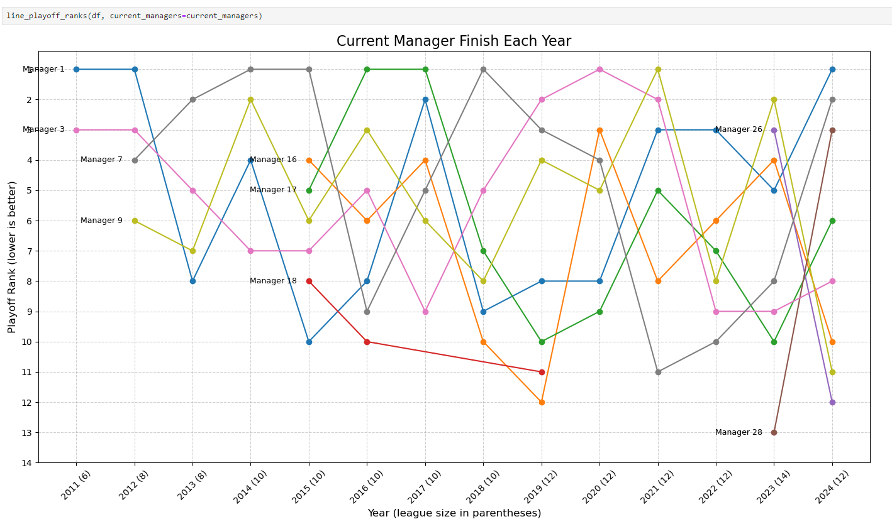
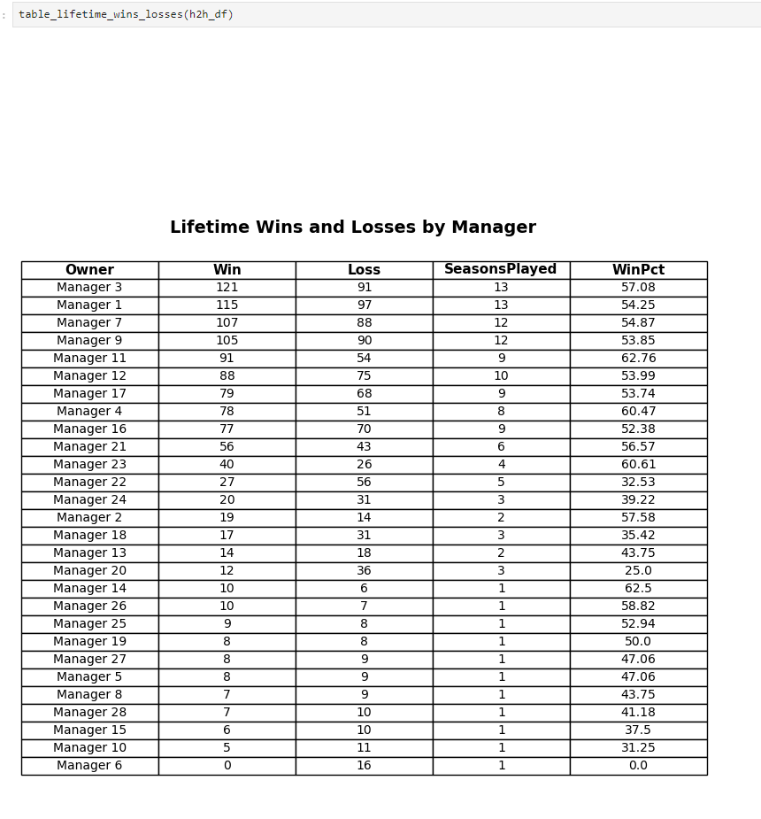
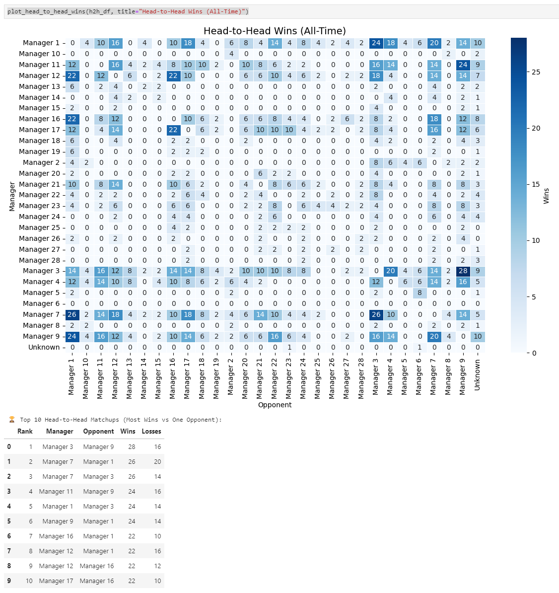
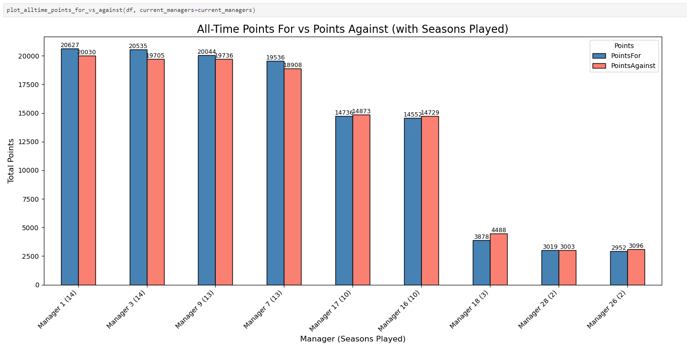
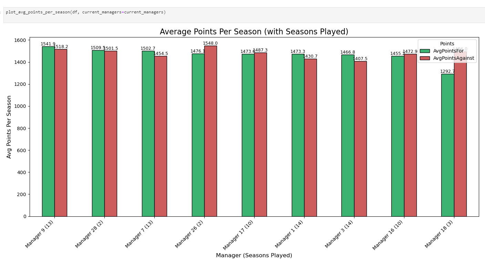

# 🏈 FF-Scraping-and-Visualizations

## Overview

This project extends the original **FF-Scraping** tool by adding a
complete set of **data visualizations** and performance summaries for
fantasy football leagues hosted on [NFL.com](https://fantasy.nfl.com).\
It allows you to **scrape**, **analyze**, and **visualize** your
league's history from its inception to the current season.

------------------------------------------------------------------------

## 🚀 What This Project Does

-   Scrapes **entire fantasy league history** from NFL.com, including
    standings and matchups.
-   Exports raw and aggregated data as CSVs in the `/output` directory.
-   Computes insights such as **biggest blowouts**, **closest wins**,
    and **season summaries**.
-   Adds a full **visualization notebook**
    (`/output/Visualizations.ipynb`) for league-wide analytics and trend
    tracking.

### 🔍 Key Features

-   **Lifetime summaries**: Championships, runner-ups, last place
    finishes, Final 4 appearances.
-   **Performance analytics**: Win/loss records, points for/against,
    draft position outcomes.
-   **Rivalry tracking**: Head-to-head win matrix and top-10 opponent
    matchups.
-   **Season visualization**: Playoff rank progression and yearly team
    identity tracking.
-   **PDF-ready charts** for sharing or archiving.

------------------------------------------------------------------------

## 🧰 How to Run It

### 1️⃣ Clone the Repository

``` bash
git clone https://github.com/CyberJrod/FF-Scraping-and-Visualizations.git
cd FF-Scraping-and-Visualizations
```

### 2️⃣ Update Configuration

Edit the following files to match your league info:

-   **`constants.py`**

    ``` python
    LEAGUE_ID = "1234567"       # Your NFL.com League ID
    START_YEAR = 2012
    END_YEAR = 2024
    ```

-   **`cookieString.py`**

    ``` python
    cookieString = "YOUR_ACTIVE_NFL_COOKIE_STRING"
    ```

    To get this cookie:

    1.  Log into your league on NFL.com.
    2.  Open **Chrome DevTools** → **Network** tab.
    3.  Click a request and copy the full **cookie header** string.

### 3️⃣ Run the Scrapers

Run these in order to generate league data:

``` bash
python scrapeStandings.py       # Scrapes season standings
python aggregateStandings.py    # Aggregates into one CSV
python scrapeGamecenter.py      # Scrapes all games
python analyzeGamecenter.py     # Finds blowouts and close games
```

All files will be saved in the `output` directory.

------------------------------------------------------------------------

## 📊 Visualization Notebook (`/output/Visualizations.ipynb`)

The Jupyter Notebook loads your scraped CSVs and generates all visuals
from the dataset.

### Included Visualizations

  -----------------------------------------------------------------------
  Visualization                           Description
  --------------------------------------- -------------------------------
  **🏆 Championships vs 1st Loser vs Last Side-by-side comparison of
  Place (Lollipop)**                      championships, 2nd place, and
                                          last place finishes for each
                                          manager.

  **🎯 Final 4 vs Bottom 4 Finishes**     Highlights league consistency
                                          and underperformance trends.

  **📈 Playoff Finish Trends**            Year-over-year playoff ranks
                                          for current managers.

  **📋 Lifetime Wins and Losses Table**   Aggregated win/loss record,
                                          seasons played, and lifetime
                                          win %.

  **🔥 Head-to-Head Wins Heatmap**        Matrix showing historical win
                                          totals vs every opponent.

  **🏅 Draft Position Podiums**           Shows how often each draft
                                          position produced a top-3
                                          finish.

  **⚡ All-Time Points (For vs Against)** Total fantasy points scored and
                                          allowed across all seasons.

  **📊 Average Points Per Season**        Per-season scoring averages
                                          compared across managers.

  **🥧 Points For vs Points Against (Pie  Season-by-season breakdowns,
  Charts)**                               highlighting champions and
                                          last-place finishers.

  **🧱 Team Names Over Time**             Visual timeline of team name
                                          changes by season and manager.
  -----------------------------------------------------------------------

------------------------------------------------------------------------

## 📸 Example Visualization Gallery

> *(For public sharing, anonymized manager and team names can be
> generated in the notebook using a one-line anonymization function
> before plotting.)*












------------------------------------------------------------------------

## 🧩 Project Architecture

### `data_loader.py`

Handles all CSV imports, cleaning, and dataset joining.\
Creates two DataFrames: - `df` → Season and standings data\
- `h2h_df` → Head-to-head matchup data

### `plots.py`

Contains all visualization and summary functions, including: - Lollipop
charts\
- Bar and line plots\
- Pie charts and heatmaps\
- Lifetime win/loss table rendering

Each plotting function produces a ready-to-display chart for use in the
Jupyter notebook or for export to PDF.

------------------------------------------------------------------------

## ⚙️ Requirements

Install dependencies with:

``` bash
pip install -r requirements.txt
```

Core libraries: - `pandas` - `numpy` - `matplotlib` - `seaborn` -
`requests` - `beautifulsoup4`

------------------------------------------------------------------------

## 📎 Attribution

-   **Original Scraper:** [FF-Scraping by
    @PeteTheHeat](https://github.com/PeteTheHeat/FF-Scraping)\
-   **Visualization:** Forked and expanded by
    [@CyberJrod](https://github.com/CyberJrod)

------------------------------------------------------------------------

## 📘 License

This project is licensed under the MIT License.\
You are free to modify, distribute, and use it for personal or
educational purposes.

------------------------------------------------------------------------

## 💡 Notes

-   Multiple managers with the same name will have results combined.
-   Assumes the **top half** of the league makes playoffs.
-   Visualization notebook designed for leagues with at least 3 seasons
    of data.
